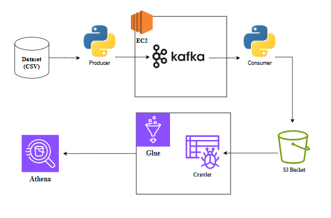

# Real-Time Stock Market Data Pipeline with Apache Kafka & AWS ☁️🚀

A complete end-to-end real-time data streaming pipeline that ingests stock market data, streams it via Kafka (running on EC2), lands it in S3 in real-time, catalogs it with Glue Crawler, and enables live querying using Athena — proving true real-time data orchestration.

### Architecture
```
Dataset (CSV)
     ↓
Python Producer (Local/Jupyter)
     ↓
Apache Kafka (on EC2 t2.micro)
     ↓
Python Consumer (Local/Jupyter)
     ↓
Amazon S3 Bucket (raw JSON files every second)
     ↓
AWS Glue Crawler → Glue Catalog Table
     ↓
Amazon Athena → Live SQL queries (row count increases every second 🔥)
```

### Architecture Diagram



### What This Project Proves
- Kafka producer/consumer running in real Python scripts
- Kafka cluster accessible from local machine (public IP + security group magic)
- Real-time data dumping into S3 as individual JSON files
- Glue Crawler automatically updating the catalog as new files arrive
- Athena showing live row count increase → actual real-time pipeline working

### Tech Stack
- Apache Kafka 3.9.1 (self-hosted on EC2)
- Python (kafka-python, pandas, boto3)
- AWS Services: EC2, S3, Glue, Athena, IAM
- Jupyter Notebook for producer & consumer

### Setup & Run (Step-by-Step)

1. Launch EC2 (t2.micro, 16GB storage recommended)  
   → Open port 9092 in security group (your IP or 0.0.0.0/0 for testing)

2. Install Kafka + Java on EC2
```bash
wget https://downloads.apache.org/kafka/3.9.1/kafka_2.13-3.9.1.tgz
tar -xvf kafka_2.13-3.9.1.tgz
sudo yum install java-11-amazon-corretto-devel -y   # I used java-25 in video but 11 also works
cd kafka_2.13-3.9.1
```

3. Edit server.properties (important for external access)
```properties
advertised.listeners=PLAINTEXT://YOUR_EC2_PUBLIC_IP:9092
```
Remove the `#` and replace with actual public IP.

4. Start Zookeeper & Kafka (2 separate SSH terminals)
```bash
bin/zookeeper-server-start.sh config/zookeeper.properties
bin/kafka-server-start.sh config/server.properties
```

5. Create topic
```bash
bin/kafka-topics.sh --create --topic demo_testing2 --bootstrap-server YOUR_EC2_IP:9092 --replication-factor 1 --partitions 1
```

6. Local machine setup
```bash
pip install kafka-python pandas boto3
aws configure   # put your access key & secret
```

7. Run Producer (`Kafka_Producer.ipynb`)
→ Samples random rows from `indexProcessed.csv` and sends to Kafka every 1 second (real-time simulation)

8. Run Consumer (`Kafka_Consumer.ipynb`)
→ Consumes from Kafka and writes each message as `stock_market_{count}.json` in S3 bucket

9. Create S3 bucket → Glue Crawler → IAM role with S3 + Glue + Athena permissions  
   Run crawler → Table appears in Glue Catalog

10. Open Athena → Query:
```sql
SELECT COUNT(*) FROM "kafka_stock_db"."kafka_real_time_data_pipeline";
```
Refresh every few seconds → row count keeps increasing = REAL-TIME MAGIC ACHIEVED ✨

### Proof (Live Demo Feel)
Every second a new JSON file lands in S3 → Crawler updates catalog → Athena shows +rows → You just built a real-time data lake.

### Repo Contents
- `Kafka_Producer.ipynb` → Real-time producer
- `Kafka_Consumer.ipynb` → Consumer → S3
- `indexProcessed.csv` → Sample stock dataset (104,761 rows)
- `commands.txt` → All terminal commands used
